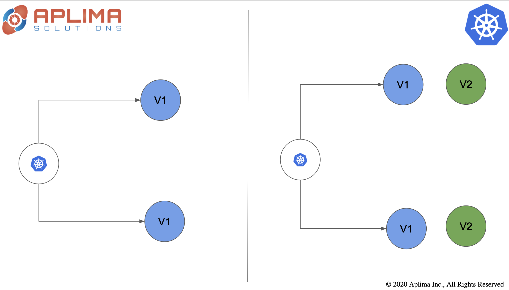
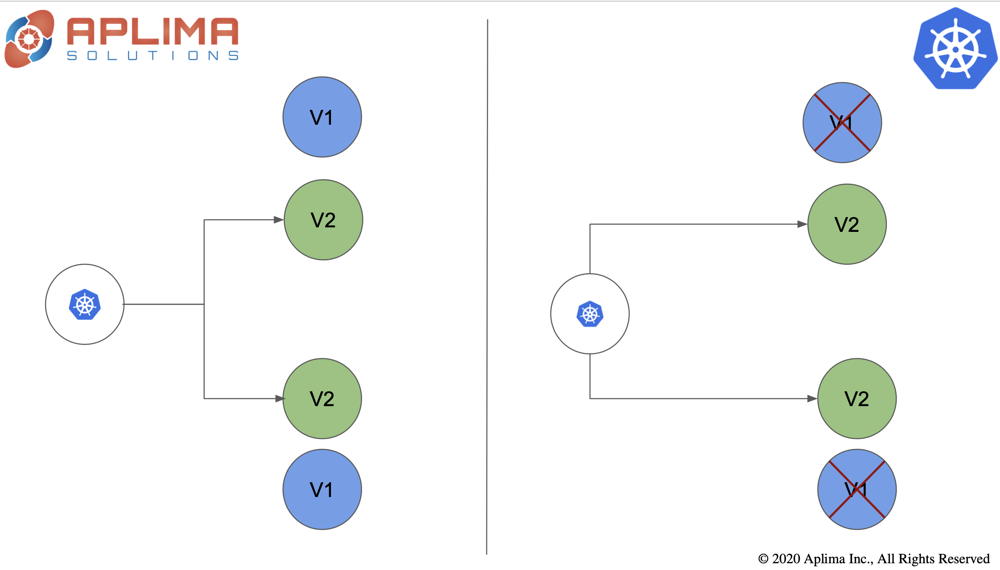

## Blue-green deployments in Kubernetes

Deploy new version parellal to old version. Test new version if all is good, point incoming traffic to new version and destory instances running the old version.

