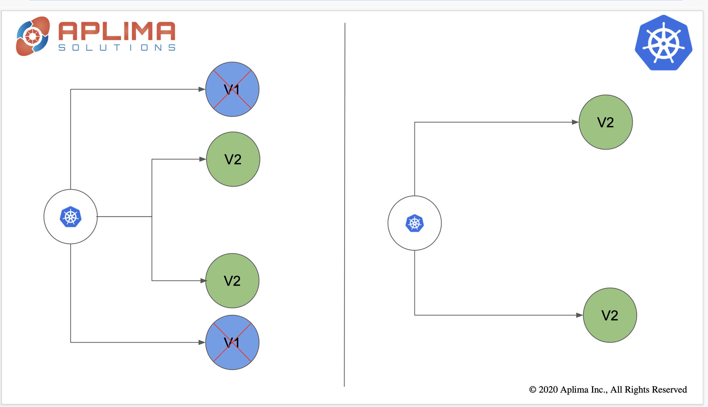

## Rolling Update Deployment Strategy

A slow rollout or zero downtime rollout. You start replacing existing pods until you have no pods to replace. This approach can slow down deployments and can be effective if you want to do slower deployment.